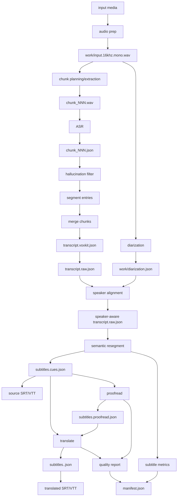

# Voxkit 能力与产物模型

本文从产品与工程边界出发，梳理 voxkit 当前和未来可扩展的原子能力、参数、产物，以及这些能力之间的关系。目标是在加入 LLM 校对、翻译、更多 ASR provider 或在线处理能力之前，先把系统的语义边界固定下来。

核心原则：

- **原始事实不可变**：ASR 的原始识别结果和时间戳是 ground truth，后续字幕切分、校对、翻译都不能反向覆盖它。
- **时间轴优先由确定性算法维护**：LLM 可以建议文本修正、术语归一、翻译和少量重排，但不直接掌控 `start` / `end`。
- **能力可组合，产物可审计**：每个阶段都应该有明确输入、输出、参数快照、事件和指标。
- **语言策略分流**：英文等有 word-level timestamp 的语言走 word-aware 路径；中文、日文、韩文等 CJK 走 phrase/char-aware 路径。
- **面向产品的产物不反解展示格式**：下游系统应读取 JSON 产物，不应从 SRT/VTT 反解结构化信息。

## 建模维度

最初可以从四个问题切入：有哪些原子能力、有哪些参数、每个能力生成什么产物、产物之间是什么关系。要让它支撑长期产品化，还需要补充几个横切维度：

| 维度 | 要回答的问题 | 为什么重要 |
|---|---|---|
| 原子能力 | 系统能独立执行哪些动作？ | 决定 CLI/API 边界、测试边界和重跑粒度。 |
| 控制参数 | 哪些行为可配置？默认值是什么？ | 决定可复现性、A/B 实验和产品 preset。 |
| 阶段产物 | 每个能力写出什么稳定文件或事件？ | 决定下游读取契约和缓存边界。 |
| 依赖关系 | 哪些能力依赖哪些产物？ | 决定 pipeline DAG、失败恢复和 stale 判断。 |
| 系统不变量 | 哪些事情永远不能发生？ | 防止 LLM 校对、翻译和字幕渲染污染 raw transcript。 |
| 产物生命周期 | draft、reviewed、final、stale 如何流转？ | 支撑人工审核、重复运行和产品状态展示。 |
| 质量指标 | 怎么判断一个产物好不好？ | 支撑自动复核、模型升级和策略选择。 |
| 产品工作流 | 用户真正想完成哪些任务？ | 把底层能力组合成可理解的默认模式。 |
| 成本与可复现性 | 怎么控制 LLM 成本、缓存和审计？ | 让批量处理、团队协作和回归排查可控。 |

## 术语

| 术语 | 含义 |
|---|---|
| 原子能力 | 可以独立运行、复用、测试和记录参数的处理步骤，例如 ASR、diarization、semantic resegment、proofread。 |
| 产物 | 某个能力写出的稳定文件或流，例如 `transcript.raw.json`、`subtitles.cues.json`、`events.ndjson`。 |
| 原始事实 | 来自媒体和 ASR/diarization 模型的一手输出，允许过滤和合并，但不允许被 LLM 美化后覆盖。 |
| 渲染层产物 | 面向播放器或字幕 UI 的产物，例如 cue 流、SRT、VTT。它们是展示决策，不等同于原始 transcript。 |
| 文本增强产物 | 校对、术语归一、翻译等 LLM 或人工处理后的文本层结果。 |
| 时间 authority | 对某段文本 `start` / `end` 的来源。英文通常是 word timestamp；CJK 可能是 phrase timestamp 或字符插值。 |
| draft | 机器生成但尚未人工确认的产物状态。 |
| reviewed | 人工或高置信规则确认过的产物状态。 |
| final | 被产品/项目锁定用于发布或下游消费的产物状态。 |
| stale | 上游输入或参数变化后，已经不再与当前 pipeline 一致的产物状态。 |
| preset | 面向产品场景的一组默认能力组合和参数，例如快速转录、双语字幕。 |

## 能力地图

### 现有能力

| 能力 | 输入 | 主要参数 | 产物 | 备注 |
|---|---|---|---|---|
| 媒体探测 | 音频/视频文件 | input path | duration、媒体类型 | 通过 ffprobe 获取时长。 |
| 音频准备 | 音频/视频文件 | 采样率 16kHz、mono | `work/input.16khz.mono.wav` 或原音频引用 | 视频抽音，音频直用。 |
| chunk 规划 | 音频时长 | `chunk_threshold_secs`、`chunk_secs`、`chunk_overlap_secs` | `ChunkPlan` | 当前为固定时间网格。 |
| chunk 抽取 | `ChunkPlan` + 音频 | chunk start/duration | `work/chunks/chunk_NNN.wav` | 长音频 checkpoint 基础。 |
| ASR 转录 | chunk wav | `model`、`language`、`word_timestamps`、`vad`、`logprob_thold`、timeout | `work/chunks/chunk_NNN.json` | whisper.cpp 后端；CJK 自动不依赖 word timestamps。 |
| 幻觉过滤 | whisper entries | blocklist、no-speech/logprob 阈值 | filtered entries、`hallucinations.log` | 过滤静音水印、ghost loop 等。 |
| ASR segment 重组 | filtered entries | 语言模式、句末标点、gap、max duration/chars | `TranscriptSegment[]` | 英文 word 聚合；CJK phrase 1:1 映射。 |
| 多 chunk 合并 | chunk segments | overlap tolerance | merged `TranscriptSegment[]`、`work/merge.json` | signal-aware overlap arbitration。 |
| 说话人切分 | 音频 | `diarize_model`、`num/min/max_speakers`、device、speaker label style | `work/diarization.json` | pyannote 后端。 |
| speaker 对齐 | merged segments + diarization | overlap / nearest fallback、label style | 带 speaker 的 Remixr segments | 写入 `transcript.raw.json`。 |
| 语义字幕重切 | Remixr segments | `resegment`、`ResegmentParams` | `subtitles.cues.json` | 只影响渲染层。英文 word-aware；CJK phrase-aware。 |
| 字幕渲染 | segments 或 cues | `emit_srt`、`emit_vtt` | `subtitles.srt`、`subtitles.vtt` | 展示格式，不作为结构化 source of truth。 |
| 字幕质量统计 | cues | `ResegmentParams` | manifest subtitle metrics、`subtitles.cues.json.metrics` | cue count、时长、闪现率、CPS 等。 |
| 事件流 | pipeline phases | `json_events` | `events.ndjson`、stderr NDJSON | 用于实时 UI、进度条、审计。 |
| manifest 汇总 | 全部阶段 | source id、参数快照 | `manifest.json` | 产物索引、耗时、warnings、metrics。 |
| **LLM 校对** (v0.4) | `subtitles.cues.json` (schemaVersion=2) | provider、model、edit_level、glossary、batch size、context | `subtitles.proofread.json` (state=draft)、checkpoint `work/proofread/batch_NNN.json` | 只改文本不改时间；按 cueId 反引源；DeepSeek/OpenAI compat；空文本拒收 + 1 次 repair。 |
| **LLM 翻译** (v0.4) | `subtitles.proofread.json`（缺则回落 `cues.json`） | provider、model、target_language、style、length_policy、glossary、batch size、context | `subtitles.<lang>.json` (state=draft)、`subtitles.<lang>.srt`/`.vtt`、checkpoint `work/translate.<lang>/batch_NNN.json` | v1 强制 `cueMappingPolicy=one-to-one`；继承源时间/speaker；不跨 speaker；空文本拒收 + repair。 |
| **生命周期推进** (v0.4) | `subtitles.proofread.json` 或 `subtitles.<lang>.json` | reviewer | 同 artifact 顶层 `state` / `reviewedBy` / `reviewedAt`；manifest 镜像 | `voxkit review confirm` (draft→reviewed) / `lock` (reviewed→final)；只能严格 +1 步。 |
| **质量评估** (v0.4) | workdir 内任意子集 (cues / proofread / `<lang>`) | 无（自动扫描） | `quality.report.json` | 物理指标 + 风险直方图 + token 用量；缺失即跳过。 |
| **批级断点续跑** (v0.5) | LLM batch + `work/<stage>/batch_NNN.{json,pending.json}` | （无 CLI flag；自动） | 成功批 → `batch_NNN.json`；transport 失败 → `batch_NNN.pending.json` | run 末若有 pending → 拒写稳定 artifact + raise；rerun 自动续做 pending。详见 §"重跑策略"。 |
| **Force-gate** (v0.5) | 已存在 artifact 的顶层 `state` | `--force` / `--force-reviewed` / `--force-final` (CLI) 或 `force_level` (API) | 拒覆盖 / 允许覆盖 | 三档隐含覆盖：final ⊃ reviewed ⊃ draft。详见 :func:`voxkit.core.lifecycle.gate_force_overwrite`。 |

### 未来扩展能力（尚未实现）

| 能力 | 输入 | 主要参数 | 产物 | 备注 |
|---|---|---|---|---|
| 术语归一独立产物 | raw/proofread text + glossary | glossary、case policy、protected terms | `terms.applied.json` | 当前 protected term 检查内嵌在 proofread risk grading；独立产物可让 audit 更细。 |
| 校对 diff 独立产物 | raw vs proofread | diff 策略 | `subtitles.proofread.diff.json` | 当前 diff 信息分散在 cue 的 `editLevel`/`risk`/`notes`；汇总成 diff 文件便于人工 review UI。 |
| 人工校对回写 | proofread/translation draft + 人工编辑 | reviewer、review policy | `subtitles.reviewed.json`（独立文件） | 当前 reviewed/final 是 artifact 顶层 state；独立 reviewed.json 文件可解耦 UI 与 pipeline。 |
| 翻译 group-within-speaker rewrap | translation cue 流 | `cueMappingPolicy=group-within-speaker` | merged `TranslationCueOut`（多 sourceCueIds） | 当前强制 one-to-one；目标语言自然换气与源语言不一致时（zh→en 长 / en→zh 短）需要重排。 |
| 在线/实时转录 | 音频流 | window size、partial/final policy | partial events、final segments | 实时数据应先进入 event stream，再沉淀为稳定产物。 |
| 多 provider ASR | audio/chunk | provider、model、timestamps mode、cost policy | provider-specific raw、normalized transcript | 需要统一 normalize schema。 |

## 参数面

参数需要分层管理，避免一个 CLI 或 API 请求变成无结构的大杂烩。

### 1. 任务与工作区参数

| 参数 | 当前/建议名称 | 作用 |
|---|---|---|
| 输入路径 | `input` | 原始媒体文件。 |
| 工作目录 | `workdir` | 所有产物落盘目录。 |
| source 标识 | `source_id` | 下游系统关联键。 |
| resume/force | `resume`、`force` | 控制 checkpoint 复用和幂等。 |
| 保留中间文件 | `keep_work` | 失败调试和审计。 |

### 2. 音频与 chunk 参数

| 参数 | 当前/建议名称 | 作用 |
|---|---|---|
| chunk 触发阈值 | `chunk_threshold_secs` | 短音频不分块。 |
| chunk 目标时长 | `chunk_secs` | 控制 ASR 单次处理长度。 |
| chunk overlap | `chunk_overlap_secs` | 接缝去重和防截断。 |
| chunk 策略 | `chunk_strategy` | 未来可扩展为 `fixed-grid` / `vad-aligned`。 |
| 边界搜索窗口 | `boundary_search_secs` | VAD 对齐 chunk 边界时使用。 |

### 3. ASR 参数

| 参数 | 当前/建议名称 | 作用 |
|---|---|---|
| ASR provider | `asr_provider` | 当前隐含为 `whisper-cpp`，未来可扩展。 |
| 模型 | `model` / `asr_model` | whisper.cpp 模型别名或 provider 模型名。 |
| 语言 | `language` | `auto` 或具体语言代码。 |
| 词级时间戳 | `word_timestamps` | 英文等非 CJK 重切的重要输入；CJK 自动忽略。 |
| VAD | `vad`、`vad_model` | 降低静音幻觉。 |
| 置信阈值 | `logprob_thold` | 过滤低置信 ASR。 |
| 超时 | `timeout_ms` | 控制单 chunk 执行时长。 |
| whisper 路径 | `whisper_bin` | 本地后端发现覆盖。 |

### 4. 清洗与合并参数

| 参数 | 当前/建议名称 | 作用 |
|---|---|---|
| 幻觉黑名单 | `blocklist` | 过滤水印、社区字幕、静音循环文本。 |
| overlap 容忍 | `overlap_tolerance_secs` | chunk merge 决策。 |
| 合并策略 | `merge_strategy` | 当前为 signal-aware；未来可暴露用于 A/B。 |

### 5. 说话人参数

| 参数 | 当前/建议名称 | 作用 |
|---|---|---|
| 是否启用 | `with_diarization` | ASR 后追加 speaker labels。 |
| 模型 | `diarize_model` | `sd-3.1` / `community-1`。 |
| speaker 数 | `num_speakers`、`min_speakers`、`max_speakers` | pyannote 聚类提示。 |
| label 策略 | `speaker_labels` | `ranked` / `raw`。 |
| 对齐策略 | `speaker_align_strategy` | 当前基于最大 overlap；可扩展 nearest fallback。 |

### 6. 字幕重切参数

| 参数 | 当前/建议名称 | 作用 |
|---|---|---|
| 重切策略 | `resegment` | `none` / `semantic`。 |
| 最大时长 | `max_dur_s` | 单 cue 时长上限。 |
| 最小时长 | `min_dur_s` | 避免闪现字幕。 |
| 最大字符数 | `max_chars` | 两行字幕物理约束。 |
| 软字符上限 | `soft_max_chars` | 优先切分/flush 阈值。 |
| CPS 上限 | `max_cps` | 阅读速度约束。 |
| 韵律 gap | `prosody_gap_s` | word-aware 切分软边界。 |
| CJK timebase | `timebase` | `phrase` / `char-interpolated`。 |

### 7. 校对参数

| 参数 | 建议名称 | 作用 |
|---|---|---|
| 是否启用 | `proofread` | 启用 LLM 校对。 |
| provider/model | `proofread_provider`、`proofread_model` | 控制 LLM 后端和成本质量。 |
| 输入层 | `proofread_input` | `raw-segments` / `semantic-cues`。默认建议 `semantic-cues`。 |
| 编辑强度 | `proofread_edit_level` | `punctuation` / `light` / `standard` / `strict`。 |
| 语言 | `proofread_language` | 可继承 ASR language。 |
| 术语表 | `glossary_path` | 专名、产品名、固定译法。 |
| 保护规则 | `protected_terms` | 不允许模型改写的 token。 |
| batch size | `proofread_batch_cues` | 控制上下文和成本。 |
| 风险阈值 | `review_threshold` | 高风险 cue 标记人工复核。 |
| 是否允许重切 | `proofread_allow_resegment` | 默认 false；如开启必须输出建议而非直接改时间。 |

### 8. 翻译参数

| 参数 | 建议名称 | 作用 |
|---|---|---|
| 是否启用 | `translate` | 启用翻译。 |
| 目标语言 | `target_language` | 如 `zh-CN`、`en`。 |
| 输入层 | `translation_input` | 默认 `proofread-cues`，无校对时退回 `semantic-cues`。 |
| 风格 | `translation_style` | `literal` / `natural` / `subtitle` / `technical`。 |
| 长度策略 | `length_policy` | `preserve` / `subtitle-fit`。 |
| cue 关系 | `cue_mapping_policy` | `one-to-one` / `group-within-speaker` / `split-to-fit`。 |
| 术语表 | `glossary_path` | 目标语言术语。 |
| 是否输出 SRT/VTT | `emit_translated_srt`、`emit_translated_vtt` | 翻译字幕渲染。 |

### 9. 输出与事件参数

| 参数 | 当前/建议名称 | 作用 |
|---|---|---|
| SRT | `emit_srt` | 输出源语言 SRT。 |
| VTT | `emit_vtt` | 输出源语言 VTT。 |
| JSON events | `json_events` | stderr NDJSON 事件流。 |
| 产物 profile | `artifact_profile` | 未来可区分 `minimal` / `debug` / `product`。 |

## 产物目录

### 当前稳定产物

| 产物 | 来源能力 | 语义层级 | 是否 source of truth | 说明 |
|---|---|---|---|---|
| `work/input.16khz.mono.wav` | 音频准备 | 媒体中间层 | 否 | 转录/diarization 实际输入。 |
| `work/chunks/chunk_NNN.wav` | chunk 抽取 | 媒体中间层 | 否 | 单 chunk ASR 输入。 |
| `work/chunks/chunk_NNN.json` | ASR | provider raw | 是，针对单 chunk | whisper.cpp 原始 JSON。 |
| `work/chunks/hallucinations.log` | 幻觉过滤 | 审计 | 否 | 被过滤条目的 NDJSON 日志。 |
| `work/merge.json` | 多 chunk 合并 | 审计 | 否 | overlap 保留/丢弃决策。 |
| `work/diarization.json` | 说话人切分 | speaker fact | 是，针对 speaker turns | pyannote 输出和 speaker 统计。 |
| `transcript.voxkit.json` | ASR pipeline | voxkit 原生 transcript | 是 | 丰富审计字段，voxkit 内部主产物。 |
| `transcript.raw.json` | Remixr adapter | Remixr transcript | 是 | 下游兼容主产物；不写 proofread 字段。 |
| `subtitles.cues.json` | 语义重切 | 渲染层结构化 cue (schemaVersion=2，含 cue.id) | 是，针对字幕展示 | SRT/VTT 的结构化同源产物。 |
| `subtitles.srt` | 字幕渲染 | 展示格式 | 否 | 给播放器/人工查看。 |
| `subtitles.vtt` | 字幕渲染 | 展示格式 | 否 | Web 播放器友好。 |
| `subtitles.proofread.json` | LLM 校对 | 源语言文本增强 (state=draft/reviewed/final) | 是，针对校对文本 | 引用 cue id，保留原时间轴；schemaVersion=1。 |
| `subtitles.<lang>.json` | LLM 翻译 | 目标语言 cue 流 (state=draft/reviewed/final) | 是，针对目标语言字幕 | sourceCueIds 反引；v1 强制 one-to-one；schemaVersion=1。 |
| `subtitles.<lang>.srt` / `.vtt` | 翻译渲染 | 展示格式 | 否 | 从 `subtitles.<lang>.json` 渲染。 |
| `quality.report.json` | 质量评估 | 审计 (schemaVersion=1) | 否 | 物理指标 + 风险直方图 + token 用量。 |
| `work/proofread/batch_NNN.json` | LLM 校对 checkpoint | 内部 cache (cacheSchema=2) | 是，针对单 batch | 含 contentHash + policyHash；rerun 命中即跳过。 |
| `work/translate.<lang>/batch_NNN.json` | LLM 翻译 checkpoint | 内部 cache (cacheSchema=2) | 是，针对单 batch | 同上。 |
| `work/<stage>/batch_NNN.pending.json` | 批级失败 marker | 内部状态 | 否 | transport 失败时落盘；rerun 看到即重做该批。 |
| `events.ndjson` | 事件流 | 运行时观测 | 否 | 实时 UI 和 debug；含 proofread/translate batch + partial 事件。 |
| `manifest.json` | 汇总 | 索引与审计 | 否 | artifacts、warnings、metrics、参数快照；含顶层 `proofread` 与 `translations.<lang>` 段。 |

## 产物生命周期

产物不只有“存在/不存在”，还应有状态。状态用于产品 UI、重跑策略、人工审核和缓存判断。

| 状态 | 含义 | 典型表达 | 可被机器覆盖吗 |
|---|---|---|---|
| `partial` | 实时或批处理中间结果，尚未稳定。 | events.ndjson 里的 `*.batch.start`、`asr.chunk.partial`、`*.batch.failed`；`work/<stage>/batch_NNN.pending.json` marker | **不进入稳定 artifact 顶层 state**——见下方规则 5。 |
| `draft` | 机器生成的完整候选结果。 | `subtitles.proofread.json` / `subtitles.<lang>.json` 顶层 `state` | 可以；`--force`（≥draft 等级）覆盖。 |
| `reviewed` | 人工确认。 | 同 artifact 顶层 `state`，附 `reviewedBy` / `reviewedAt` | 默认不覆盖；需 `--force-reviewed`（v0.5+）。 |
| `final` | 锁定发布。 | 同上 | 不允许自动覆盖；需 `--force-final`（v0.5+，**销毁人工 lock 元数据，慎用**）。 |
| `stale` | 上游 inputHash / policyHash 变化。 | UI 推导态（manifest 内的 inputHash 与现 cues.json 比对） | 不直接删除；提示过期。 |
| `failed` | 阶段失败留下错误信息。 | run 抛 exception；manifest 不写新段（旧段保留） | 不写半成品 artifact。 |
| `incomplete` (v0.5) | 部分 batch 传输失败 → 整个 stable artifact 拒写出 | `pending.json` marker + `LLMError("incomplete")` 异常 + `*.partial` 事件 | 不写顶层 state，靠 marker 表达；rerun 自动续做。 |

生命周期规则：

1. 上游 source of truth 变化时，下游 draft/reviewed/final 必须重新计算 freshness（依赖 manifest 的 `inputHash`）。
2. `reviewed` 和 `final` 产物的人工操作记录写在 artifact 顶层（`reviewedBy`/`reviewedAt`），manifest 镜像。
3. 机器重跑默认只覆盖 `draft`；`--force` 三档（`draft`/`reviewed`/`final`）控制覆盖等级，高级隐含低级；详见 :func:`voxkit.core.lifecycle.gate_force_overwrite`。
4. `stale` 不是错误状态，UI 比对 `manifest.<stage>.inputHash` 与当前 cues.json 字节 hash 即可推导。
5. 实时 `partial` 只服务 events / pending marker，**不进入稳定 artifact 顶层 state**。`incomplete` 状态用 pending marker 文件表达，不持久化到 artifact —— rerun 看到 marker 就只重做该批，已成功批次自动 cache 命中（详见 §"重跑策略"）。

## 产物关系



关系规则：

1. `transcript.voxkit.json` 和 `transcript.raw.json` 是 ASR/transcript 层产物，不承载校对后的文本。
2. `subtitles.cues.json` 是源语言渲染层 source of truth；SRT/VTT 只是它的展示格式。
3. `subtitles.proofread.json` 只引用 cue id，不覆盖 `subtitles.cues.json`。
4. `subtitles.<lang>.json` 是目标语言字幕 source of truth，不覆盖源语言 cue。
5. `manifest.json` 只做索引和审计，不应成为唯一数据来源。
6. `events.ndjson` 可以包含实时 partial 数据，但稳定文件写出后以稳定文件为准。

## 系统不变量

这些规则优先级高于任何单个能力的实现细节。

### 数据层不变量

- `transcript.voxkit.json` 和 `transcript.raw.json` 只表达 ASR/transcript 层，不写入校对后的文本。
- `subtitles.cues.json` 只表达源语言渲染层 cue，不被 LLM 校对结果覆盖。
- `subtitles.proofread.json` 引用源 cue id，保存校对文本和风险标记，不反写 raw/cues。
- `subtitles.<lang>.json` 是目标语言字幕产物，不覆盖源语言字幕。
- SRT/VTT 永远是渲染结果，不作为结构化 source of truth。

### 时间轴不变量

- LLM 默认不得修改 `start` / `end` / `speaker`。
- 如未来允许 retiming，必须输出 retiming proposal，经过确定性校验后由独立阶段应用。
- 翻译 cue 不得跨 speaker 合并。
- 翻译 cue 的时间范围应被其 `sourceCueIds` 覆盖；任何扩展都必须记录原因。
- CJK 字符插值是字幕层 timebase，不应伪装成 word-level timestamp。

### 可审计性不变量

- 每个 LLM 产物必须记录 provider、model、prompt/schema version、参数、输入 artifact hash。
- 每个高风险修改必须能定位到原 cue 和原文本。
- 同一次运行内，稳定产物写出应是原子性的：要么完整成功，要么不替换旧文件。
- 参数默认值变化需要在 changelog 或 manifest 中可追踪。

## 校对产物建议 schema

校对默认以 `subtitles.cues.json` 为输入，因为它已经是适合人类阅读的字幕单元。LLM 不直接处理 SRT，不直接改时间戳。

```jsonc
{
  "schemaVersion": "1",
  "sourceId": "YTVSwOY19Qs",
  "inputArtifact": "subtitles.cues.json",
  "language": "zh",
  "provider": "openai",
  "model": "example-model",
  "params": {
    "editLevel": "standard",
    "allowRetiming": false,
    "glossaryVersion": "2026-05-10"
  },
  "cues": [
    {
      "cueId": "cue_000001",
      "sourceStart": 0.1,
      "sourceEnd": 4.2,
      "speaker": "Speaker 1",
      "sourceText": "原始字幕文本",
      "correctedText": "校对后的字幕文本",
      "editLevel": "minor",
      "risk": "low",
      "needsHumanReview": false,
      "notes": []
    }
  ],
  "metrics": {
    "cueCount": 1000,
    "changedCueRate": 0.37,
    "reviewCueRate": 0.04
  }
}
```

校对 invariants：

- `cueId` 必须来自输入 cue，且不重复。
- 默认 `sourceStart` / `sourceEnd` 必须等于输入 cue 的时间。
- `correctedText` 不得为空，除非原文为空或 cue 被标记为删除建议。
- 数字、日期、人名、产品名、URL、代码片段变更应标记更高风险。
- LLM 无法确定时应保守输出 `needsHumanReview=true`，而不是编造。

## 翻译产物建议 schema

翻译建议以校对后的 cue 为输入；如果没有校对产物，可以回退到 `subtitles.cues.json`。翻译允许在同一 speaker 的连续时间范围内重新拆分，以满足目标语言阅读速度。

```jsonc
{
  "schemaVersion": "1",
  "sourceId": "YTVSwOY19Qs",
  "inputArtifact": "subtitles.proofread.json",
  "sourceLanguage": "zh",
  "targetLanguage": "en",
  "provider": "openai",
  "model": "example-model",
  "params": {
    "style": "subtitle",
    "lengthPolicy": "subtitle-fit",
    "cueMappingPolicy": "group-within-speaker"
  },
  "cues": [
    {
      "id": "trg_000001",
      "sourceCueIds": ["cue_000001", "cue_000002"],
      "start": 0.1,
      "end": 5.8,
      "speaker": "Speaker 1",
      "text": "Translated subtitle text.",
      "mapping": "merged",
      "risk": "low"
    }
  ],
  "metrics": {
    "cueCount": 920,
    "overCpsRate": 0.02,
    "overCharLimitRate": 0.01
  }
}
```

翻译 invariants：

- `sourceCueIds` 必须能追溯到源语言 cue。
- 翻译 cue 不得跨 speaker 合并。
- 翻译 cue 的时间范围默认必须被其 `sourceCueIds` 覆盖；如需扩展时间，必须显式标记原因。
- 目标语言 SRT/VTT 必须从 `subtitles.<lang>.json` 渲染，不从 LLM 直接生成的 SRT 读取。
- 翻译后的 cue 也要跑字幕物理指标：duration、chars、CPS、闪现率。

## 质量指标与风险分级

质量指标分两类：一类是物理指标，能自动计算；另一类是语义风险，通常用于抽样或人工复核。

### 字幕物理指标

| 指标 | 适用产物 | 含义 |
|---|---|---|
| `cueCount` | cues/proofread/translation | cue 总数。 |
| `avgCueDurS` / `p50CueDurS` / `p90CueDurS` | cues/proofread/translation | 字幕展示时长分布。 |
| `flashCueRate` | cues/proofread/translation | 低于 `min_dur_s` 的闪现字幕比例。 |
| `longCueRate` | cues/proofread/translation | 超过 `max_dur_s` 的长字幕比例。 |
| `avgChars` | cues/proofread/translation | 平均字符数。 |
| `overCharLimitRate` | cues/proofread/translation | 超过字符上限的比例。 |
| `overCpsRate` | cues/proofread/translation | 超过阅读速度上限的比例。 |
| `speakerSwitchCueRate` | cues/translation | cue 是否异常跨 speaker 或 speaker 变化过密。 |
| `trailingBadWordRate` (v0.5.1) | cues/proofread/translation | 末尾停在介词/冠词/连词/助动词等"不完整成分"的 cue 比例。仅 Latin 主体启用（CJK 无词性概念）。带停顿标点 (`.!?,;:`) 的末尾豁免。 |
| `singleWordCueRate` (v0.5.1) | cues/proofread/translation | 仅含单个 token 的 cue 比例。典型闪屏症状（"I'll" 0.17s）。 |
| `crossCueRepeatRate` (v0.5.1) | cues/proofread | 相邻 cue 末尾 1-3 词与下一 cue 开头 1-3 词重复的比例。proofread 错误闭合切坏边界的典型征兆（如 cue N 末尾 "is it" + cue N+1 开头 "Is it"）。 |

### ASR 与时间轴风险

| 风险 | 触发条件 | 建议处理 |
|---|---|---|
| `low_confidence` | `avg_confidence` 低或 logprob 低。 | 校对时给更多上下文，或标人工复核。 |
| `hallucination_drop_nearby` | cue 附近有 blocklist 过滤记录。 | 标记高风险。 |
| `chunk_boundary_nearby` | cue 距 chunk 接缝很近。 | 检查截断、重复、漏词。 |
| `speaker_unmatched` | speaker 为 `Speaker ?` 或 diarization 无 overlap。 | UI 提醒 speaker 不确定。 |
| `timebase_interpolated` | CJK 字符插值生成时间。 | 不用于精确剪辑点，只用于字幕展示。 |

### 校对风险

| 风险 | 触发条件 | 建议处理 |
|---|---|---|
| `numeric_change` | 数字、日期、金额、百分比变化。 | 默认人工复核。 |
| `named_entity_change` | 人名、机构、产品、地名变化。 | 结合 glossary 或人工复核。 |
| `large_text_delta` | 文本长度或编辑距离超阈值。 | 标记 major edit。 |
| `empty_or_deleted` | 非空源文本被改为空。 | 默认拒绝或人工确认。 |
| `protected_term_change` | protected terms 被改写。 | 自动回滚该 cue 或标 high risk。 |
| `uncertain_model_output` | LLM 自报不确定或输出 schema 校验失败。 | 重试或人工复核。 |

### 翻译风险

| 风险 | 触发条件 | 建议处理 |
|---|---|---|
| `length_expansion` | 目标语言显著长于源语言，CPS 超限。 | 触发 subtitle-fit 重排或二次压缩。 |
| `glossary_miss` | 目标文本没有使用指定术语。 | 自动修正或复核。 |
| `source_coverage_gap` | source cue 没有对应翻译。 | 重试该 batch。 |
| `source_coverage_duplicate` | source cue 被多个目标 cue 重复覆盖且非 split。 | 校验 mapping。 |
| `speaker_crossing` | 目标 cue 跨 speaker。 | 自动拒绝。 |
| `style_violation` | 不符合指定 style，例如过度意译。 | 低优先级复核或模型重试。 |

建议风险等级：

| 等级 | 含义 | 默认动作 |
|---|---|---|
| `low` | 普通修改，自动接受。 | 进入 draft。 |
| `medium` | 可能影响理解。 | UI 标记，可抽样复核。 |
| `high` | 可能引入事实错误。 | 默认人工复核。 |
| `blocking` | 违反 schema、不变量或覆盖关系。 | 在 cue 层强制 `needsHumanReview=true`。**当前实现仍写入 stable draft（cue 仍可被人工修复），但 `quality.report.json` 风险直方图会单独凸显** —— 严格 "拒绝写产物" 只在批级 transport 失败时触发（写 `pending` marker，整批 artifact 不落盘）。 |

> **未知/缺失 risk** 在 `quality.report.json` 聚合时会被强制归入 `blocking` 桶（保守路线），避免 malformed LLM 输出悄悄按 `low` 通过审核。

## 实时数据与稳定产物

实时能力应该使用事件流承载中间状态，稳定产物只在阶段完成后写入。

建议事件类型：

| 事件 | 含义 |
|---|---|
| `audio.prep.start/done` | 音频准备开始/完成。 |
| `chunk.plan.done` | chunk 计划生成。 |
| `asr.chunk.start/partial/done` | 单 chunk ASR 进度；partial 只供 UI 展示。 |
| `asr.merge.done` | 多 chunk 合并完成。 |
| `diarization.start/done` | 说话人切分开始/完成。 |
| `resegment.done` | 字幕 cue 重切完成。 |
| `proofread.batch.start/done` | 校对批次完成。 |
| `translate.batch.start/done` | 翻译批次完成。 |
| `artifact.write` | 某个稳定产物写出。 |
| `quality.done` | 指标和风险报告生成。 |

事件规则：

- partial 事件不能被下游当成最终 transcript。
- 稳定产物写出后，manifest 记录路径、hash、参数快照和 warnings。
- 如果某阶段失败，已有上游稳定产物仍可复用；下游产物必须标记缺失或失败，不应写半成品覆盖旧文件。

## 成本、缓存与可复现性

ASR、diarization 和 LLM 阶段的成本结构不同。设计上应允许每个阶段单独缓存、重跑和审计。

### 缓存键

| 阶段 | 建议缓存键组成 |
|---|---|
| audio prep | input file path、mtime/hash、ffmpeg 参数。 |
| chunk ASR | chunk audio hash、ASR provider、model、language、word timestamp mode、VAD 参数、logprob 阈值。 |
| diarization | audio hash、diarize model、speaker hints、device 无关模型参数。 |
| semantic resegment | input transcript hash、language、`ResegmentParams`。 |
| proofread | `contentHash` = sha256(id, text, start, end, speaker)；`policyHash` = sha256(provider, model, promptVersion, promptHash, editLevel, glossaryHash, cacheSchema)；命中需两者都相等且 cacheSchema 与当前实现一致。 |
| translation | `contentHash` 与 proofread 同形；`policyHash` 含 (provider, model, promptVersion, promptHash, style, lengthPolicy, cueMappingPolicy, glossaryHash, sourceLanguage, targetLanguage, cacheSchema)。 |

> **content hash 必须含 start/end/speaker**：上游 source cue 改了时间或 speaker 但 id+text 没变时，cache 必须失效——否则下游 proofread/translation 会按旧时间轴回写，污染"时间轴不变量"。

### Manifest 应记录的信息

实际实现采用**顶层** `proofread` 与 `translations.<lang>` 两个段（不是 `stages.<name>` 命名空间），用于减少嵌套深度。下游消费者（含 `voxkit review` 镜像写入路径）必须从这两个 key 读：

```jsonc
{
  "proofread": { "state": "...", "provider": "...", "model": "...",
                 "promptVersion": "proofread.v1", "promptHash": "...",
                 "inputArtifact": "subtitles.cues.json", "inputHash": "sha256:...",
                 "outputArtifact": "subtitles.proofread.json", "outputSchemaVersion": "1",
                 "freshPromptTokens": ..., "cachedPromptTokens": ...,
                 "promptTokens": ..., "completionTokens": ..., ... },
  "translations": {
    "zh": { "state": "...", "sourceLanguage": "...", "targetLanguage": "zh",
            "outputArtifact": "subtitles.zh.json", "outputSchemaVersion": "1",
            "style": "...", "lengthPolicy": "...", "cueMappingPolicy": "one-to-one",
            "freshPromptTokens": ..., "cachedPromptTokens": ..., ... }
  }
}
```

| 字段 | 作用 |
|---|---|
| artifact path/hash | 判断 freshness 和复现输入。 |
| provider/model | 排查模型升级影响。 |
| prompt/schema version | LLM 行为变化可追踪。 |
| glossary version/hash | 术语变化可追踪。 |
| elapsed/rtf/token usage | 评估性能和成本（fresh vs cached 拆分）。 |
| warnings/errors | 产品 UI 和自动复核入口。 |
| metrics | 策略比较和质量门禁。 |

### 重跑策略

- 默认重跑只更新缺失或 stale 的 draft 产物。
- `--force` 三档（与 `voxkit proofread` / `voxkit translate` CLI 同名）：
  - `--force`：只覆盖 draft；遇 reviewed/final 拒绝。
  - `--force-reviewed`：允许覆盖 reviewed；隐含 `--force`。
  - `--force-final`：允许覆盖 final；销毁人工 lock 元数据，慎用。
- 任一 force 档都**只清空 `work/proofread/` 或 `work/translate.<lang>/` checkpoint 目录**；旧 stable artifact **不预先 unlink**，仅在新批次全部完成后通过 `os.replace` 原子替换。LLM 中途失败时旧 artifact 完整保留。
- LLM batch 失败分两类：
  - 内容层（`LLMSchemaError` / `LLMRefusal`）：本批 fallback 写 risk=blocking + needsHumanReview，落 checkpoint，run 继续。
  - 传输/限流（`LLMTimeout` / `LLMRateLimit` / 5xx 耗尽）：本批写 `batch_NNN.pending.json` marker，run 继续；末尾若有任何 pending → **拒绝写稳定 artifact** + 抛 `LLMError("incomplete")`。rerun（无需 --force）只重做 pending 批，已完成 checkpoint 自动复用。
- 旧版本产物应至少保留 hash 和 manifest 记录；是否保留完整文件可由 artifact retention policy 控制。
- 当 provider/model 不可用时，应明确失败，不要静默切换到另一个模型生成不可比较的产物。
- 成本审计：manifest 中 `freshPromptTokens` / `freshCompletionTokens` 记录本轮真的花掉的 token；`cachedPromptTokens` / `cachedCompletionTokens` 来自 checkpoint。两者之和（`promptTokens` / `completionTokens`）保留兼容旧消费者。

## 产品视角的能力组合

| 产品模式 | 推荐能力链 | 默认关注点 | 主要产物 |
|---|---|---|---|
| 快速转录 | audio prep -> ASR -> merge -> raw transcript -> SRT/VTT | 速度、resume、低成本 | `transcript.raw.json`、`subtitles.srt/vtt` |
| 播放器字幕 | 快速转录 -> semantic resegment -> cues -> SRT/VTT | 阅读体验、CPS、闪现率 | `subtitles.cues.json` |
| 访谈/多人内容 | ASR -> diarization -> speaker alignment -> resegment | speaker 准确性、跨 speaker 不合并 | `work/diarization.json`、speaker-aware cues |
| 高质量源语言字幕 | 播放器字幕 -> proofread -> risk report -> optional review | 术语、标点、事实安全 | `subtitles.proofread.json`、diff |
| 双语字幕 | proofread -> translate -> subtitle-fit -> target render | 目标语言阅读速度、术语一致 | `subtitles.<lang>.json`、target SRT/VTT |
| 精修交付 | proofread/translation draft -> human review -> final lock | 生命周期、权限、版本冻结 | `subtitles.reviewed.json`、final artifacts |
| 数据分析/剪辑 | raw transcript + speaker turns + cues + proofread text | 时间精度、可追溯、检索 | raw transcript、speaker turns、cue index |
| 实时预览 | audio stream -> partial ASR events -> final stabilization | latency、partial/final 区分 | events、final segments |

建议第一批 preset：

| Preset | 能力组合 | 推荐默认值 |
|---|---|---|
| `fast-transcript` | ASR + merge + raw export | `resegment=none`，不启用 LLM。 |
| `subtitle` | ASR + semantic resegment + SRT/VTT | `resegment=semantic`，输出 `subtitles.cues.json`。 |
| `interview` | ASR + diarization + semantic resegment | `with_diarization=true`，`speaker_labels=ranked`。 |
| `proofread-subtitle` | subtitle + proofread + diff/risk | `proofread_input=semantic-cues`，`allowRetiming=false`。 |
| `bilingual-subtitle` | proofread-subtitle + translation | `length_policy=subtitle-fit`，允许同 speaker group 重排。 |
| `review-ready` | bilingual-subtitle + quality report | high/blocking 风险进入人工审核队列。 |

## 推荐实现顺序

| # | 项目 | 状态 | 实现引用 |
|---|---|---|---|
| 1 | 冻结能力模型和不变量 | ✓ v0.4 | 本文 |
| 2 | cue 稳定 id | ✓ v0.4 | `subtitles.cues.json` schemaVersion=2，cue.id `cue_NNNNNN` |
| 3 | artifact hash 与 freshness | ✓ v0.4-v0.5 | manifest 含 `inputHash` / `inputArtifact` / `outputArtifact` / `outputSchemaVersion`；checkpoint 含 `contentHash`/`policyHash`/`cacheSchema` |
| 4 | proofread draft | ✓ v0.4 | `voxkit proofread` → `subtitles.proofread.json`；时间字段从源 cue 拷贝，validator 拒空白文本 |
| 5 | proofread diff/risk | ✓ v0.4 | `voxkit.core.proofread_risk.grade_risk`：numeric_change / protected_term_change / empty_or_deleted / large_text_delta |
| 6 | translation draft | ✓ v0.4 | `voxkit translate` 优先 proofread 输入；one-to-one；继承源时间/speaker；渲染 SRT/VTT |
| 7 | 统一 metrics | ✓ v0.4 | `quality.report.json` 同时跑 cues / proofread cue / translation 物理指标 |
| 8 | 参数全量写 manifest | ✓ v0.4-v0.5 | proofread/translations 段含 provider/model/promptVersion/promptHash/glossaryHash/cacheSchema/freshTokens vs cachedTokens |
| 9 | preset 层 | ⏳ 未实现 | 文档 §"产品视角的能力组合"已设计；未来 `--preset bilingual-subtitle` 等 |
| 10 | UI/人工审核 | ⏳ 部分 | `voxkit review confirm/lock` 已支持；UI 端待 Remixr 集成 |

## v0.5+ 后续方向

| 项目 | 优先 | 说明 |
|---|---|---|
| `voxkit/core/llm_batch_runner.py` 通用化 | 中 | proofread/translate batch 主循环 ~110 行近似复制；抽 generic `BatchProcessor` 协议消除两边漂移风险（Codex H2） |
| `voxkit/io/atomic.py` 整合 | 中 | 4 处 atomic write helper 散在 lifecycle/translate/workspace/quality_metrics；统一崩溃语义（Codex M1） |
| 翻译 `cueMappingPolicy=group-within-speaker` | 中 | 当前强制 1:1；目标语言阅读速度与源差距大时（zh→en 长 / en→zh 短）需要同 speaker 连续区间重排 |
| 翻译 `length_policy=subtitle-fit` | 中 | 当前 prompt 已支持 style 控制，但实际 LLM 没主动压缩；需要后处理验证 + 二次 prompt |
| 校对 diff 独立产物 | 低 | 当前 diff 信息分散在 cue 字段；汇总成 `subtitles.proofread.diff.json` 便于审核 UI |
| 在线/实时转录 | 低 | 用 `events.ndjson` 协议承载 partial；voxkit 当前架构已留口 |
| 多 provider ASR | 低 | LLM 已是 multi-provider；ASR 仍 whisper.cpp only |

## 已解决的待定问题

- **校对输入默认** → 默认 `subtitles.cues.json`（schemaVersion=2 强制）；不回退 raw（保留单一 source of truth）
- **proofread 合并/拆分 cue** → v1 不允许；只改文本；重切需要时走独立 stage
- **翻译强制 one-to-one** → v1 强制 (`cueMappingPolicy="one-to-one"`)；`group-within-speaker` 留 v0.6+
- **`subtitles.cues.json` schemaVersion 升 "2"** → 已升，强制；旧 workdir 重新生成
- **glossary 配置** → 任务级 `--glossary path` 支持；项目级配置待 preset 实现
- **reviewed/final 覆盖权限层级** → CLI 层 `--force`/`--force-reviewed`/`--force-final` 三档；workspace lock 仍用于并发互斥（不接管覆盖语义）

## 仍待定的问题

- LLM 成本预算（按任务 / workspace / project）尚未设计；当前只在 manifest 记录 fresh vs cached token，无预算控制
- preset CLI 入口形态（`--preset` flag vs 子命令）
- 多 provider ASR 的 provider raw 落盘策略
